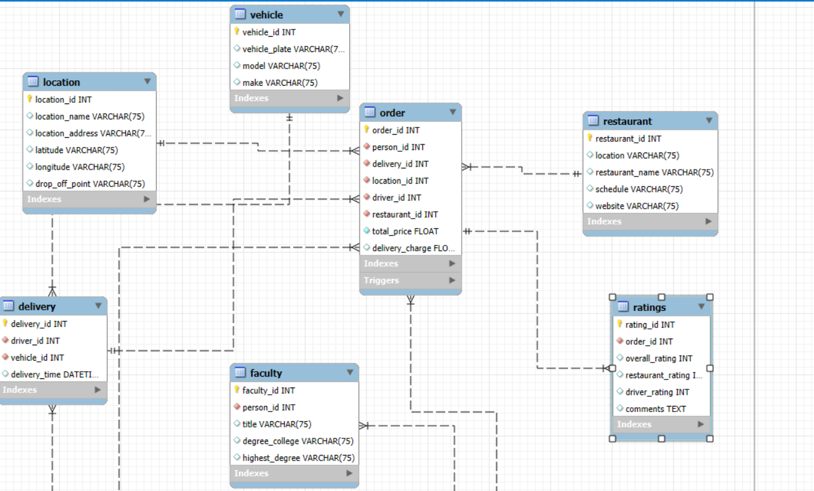

# **Delivery and Rating System Database Project**

## **Overview**
This project implements a relational database for managing a delivery and rating service. The system includes tables for drivers, vehicles, customers, deliveries, and ratings. It incorporates stored procedures, triggers, views, and functions to automate processes and enhance data accessibility.

---

## **Database Schema**

### **Main Tables**
- **Driver**: Stores driver details, including name, rating, and associated vehicle.
- **Vehicle**: Contains vehicle information such as model, make, and registration number.
- **Restaurant**: Tracks restaurant details, including location, operating hours, and website.
- **Delivery**: Manages delivery details, linking drivers and customers.
- **Ratings**: Stores customer ratings for drivers and restaurants.
- **Person**: Stores customer information, including name, email, and phone number.

### **Additional Tables**
- **Faculty**, **Student**, **Staff**, etc., for related academic contexts.

---

## **Features**

### **1. Stored Procedure**
#### **Name**: `GetDriverAvgRating`
A stored procedure to calculate the average rating for a given driver. <br>

#### **Syntax**:
```sql
CALL GetDriverAvgRating(driver_id, @avg_rating);
SELECT @avg_rating AS AverageRating;
